# Training & Speed Evaluation Tools for [`gymnax`](https://github.com/RobertTLange/gymnax)

<a href="https://github.com/RobertTLange/gymnax-blines/blob/main/docs/logo.png?raw=true"></a>


In this repository we provide training pipelines for [`gymnax`](https://github.com/RobertTLange/gymnax) agents in JAX. Furthermore, you can use the utilities to speed benchmark step transitions and to visualize trained agent checkpoints. Install all required dependencies via:

```
pip install -r requirements.txt
```

## Accelerated Training of Agents with [`gymnax`](https://github.com/RobertTLange/gymnax)

We provide training routines and the corresponding checkpoints for both Evolution Strategies (mostly OpenES using [`evosax`](https://github.com/RobertTLange/evosax) and PPO (using an adaptation of @bmazoure's [implementation](https://github.com/bmazoure/ppo_jax)). You can train the agents as follows: 

```
python train.py -config agents/<env_name>/ppo.yaml
python train.py -config agents/<env_name>/es.yaml
```

This will store checkpoints and training logs as `pkl` in `agents/<env_name>/ppo.pkl`. Collect all training runs sequentially via:

```
bash exec.sh train
```

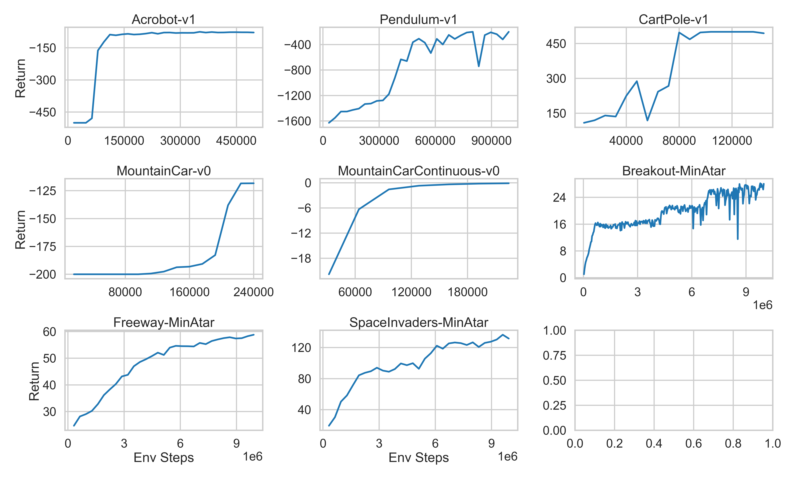

## Visualization of [`gymnax`](https://github.com/RobertTLange/gymnax) Environment Rollouts

You can also generate GIF visualizations of the trained agent's behaviour as follows:

```
python visualize.py -env <env_name> -train <{es/ppo}>
```

Collect all visualizations sequentially via:

```
bash exec.sh visualize
```

Note that we do not support visualizations for most behavior suite environments, since they do not lend themselves to visual display (e.g. markov reward process, etc.).

|  |  |  |  | 
| --- | --- | --- | --- |
| 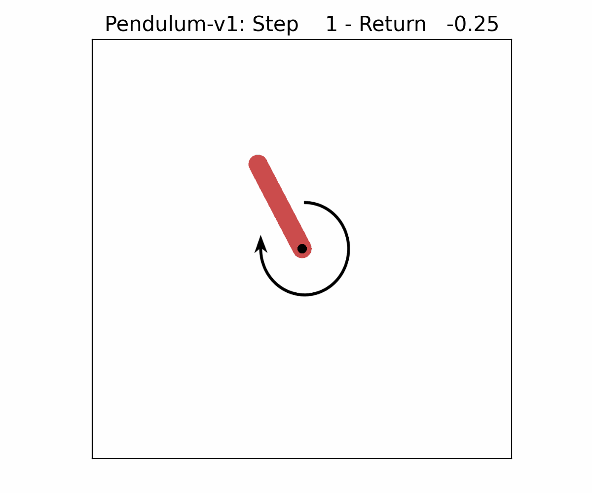 | 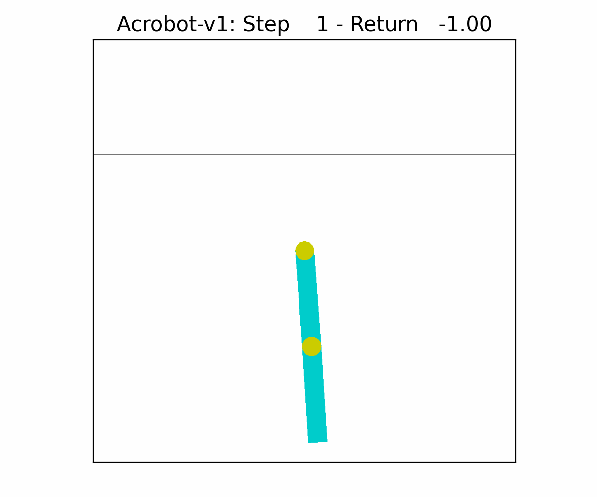  |  | 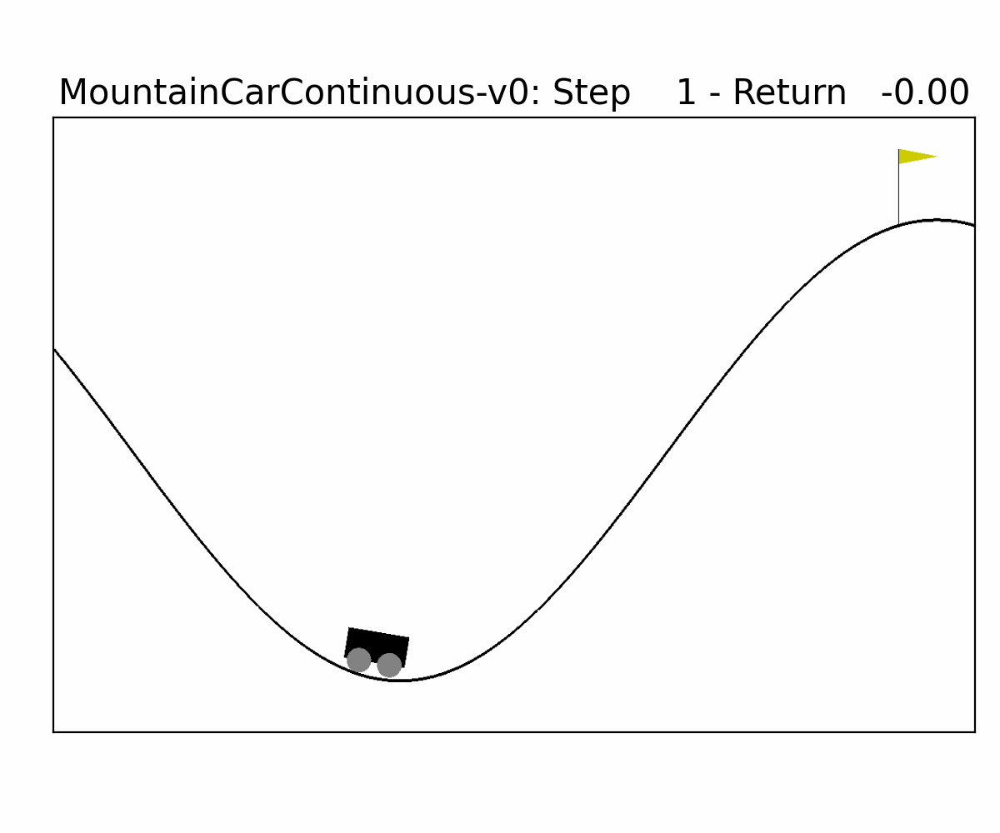 |
| 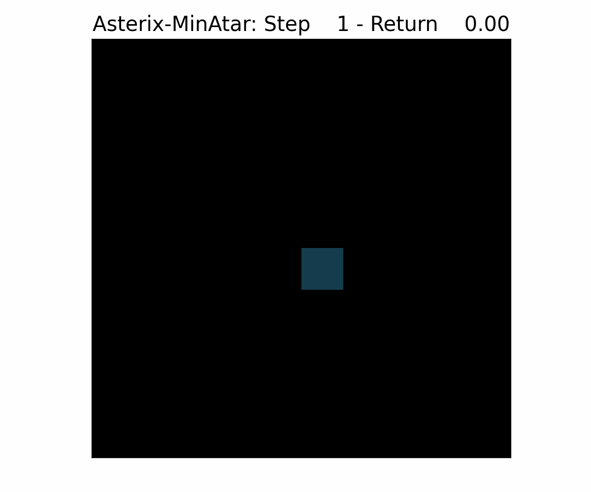 | 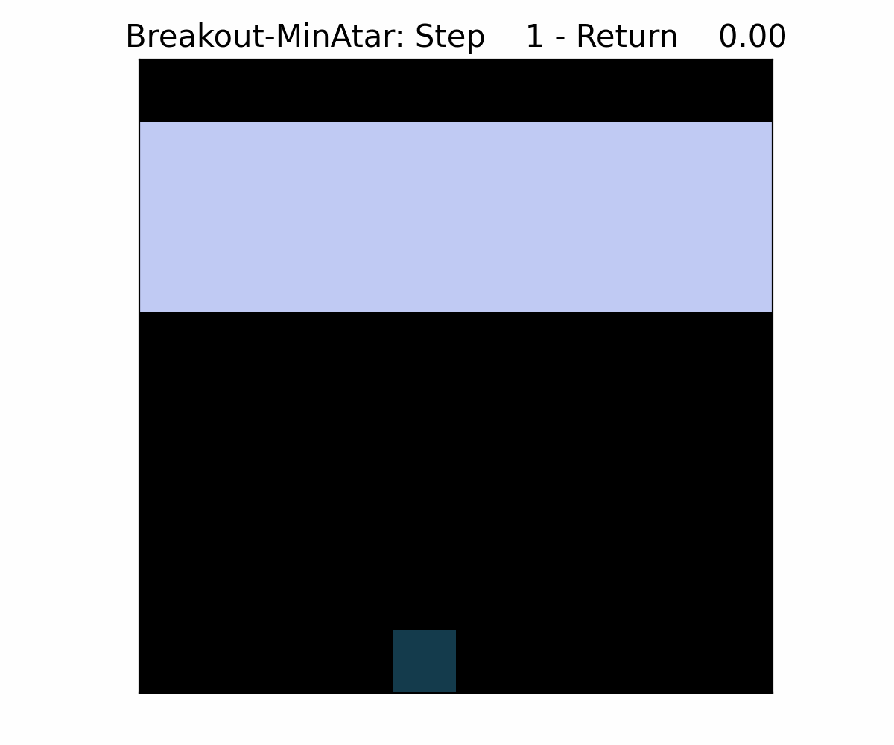  | 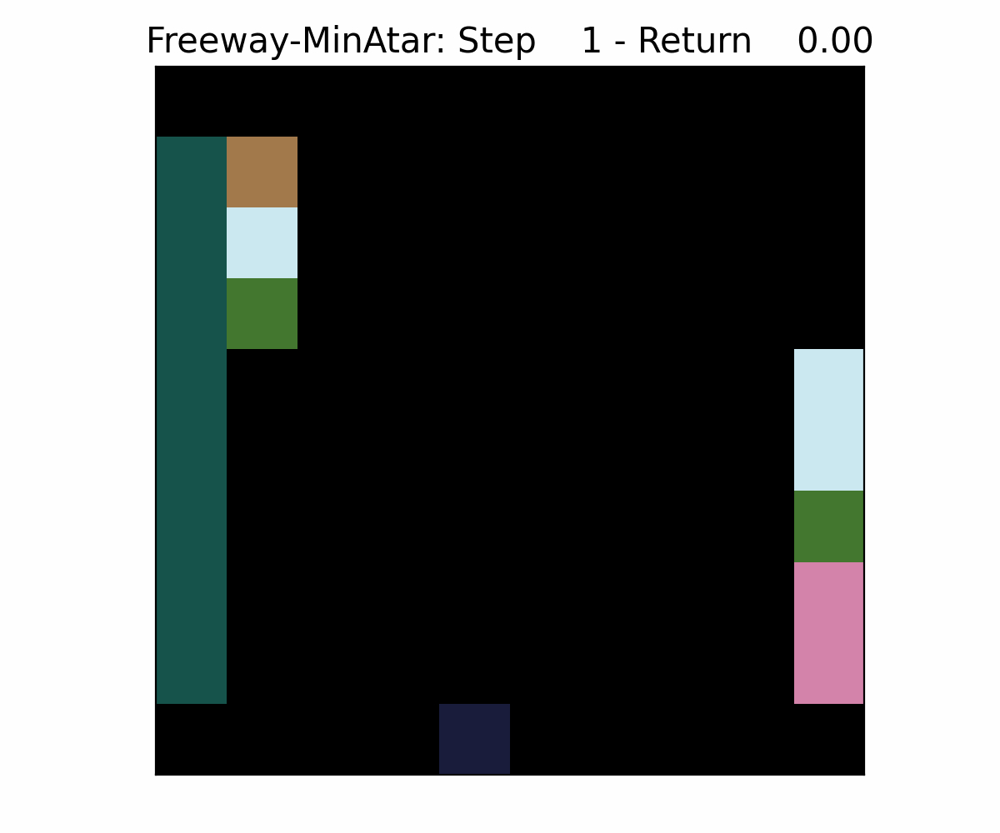 | 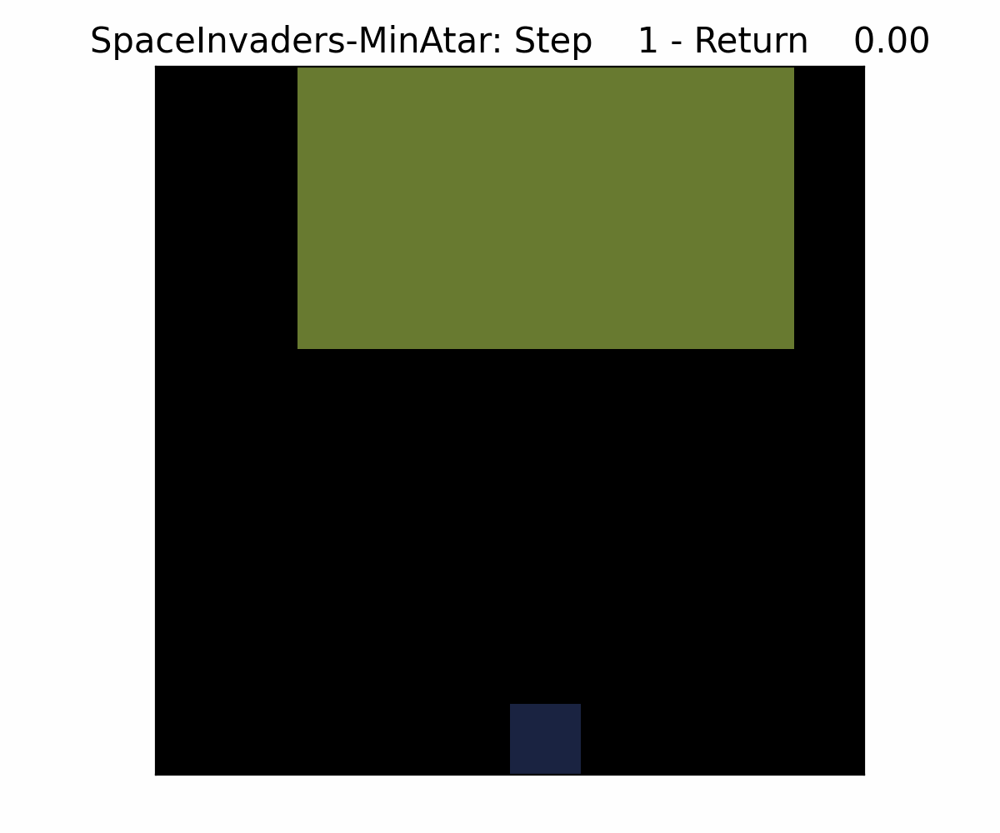 |
| 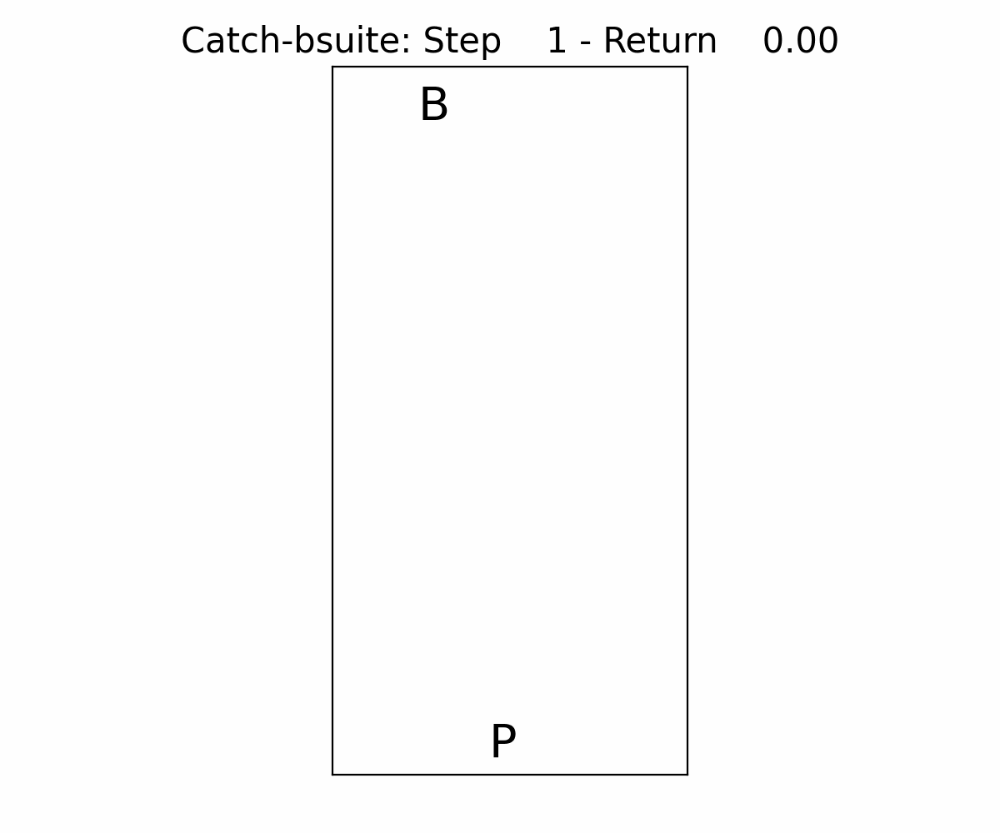 | 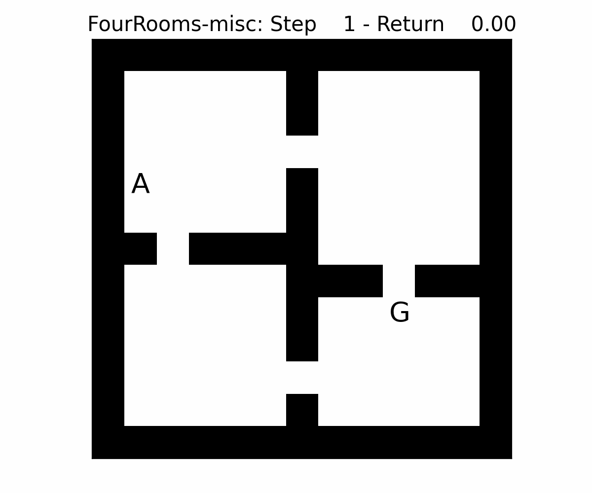  | 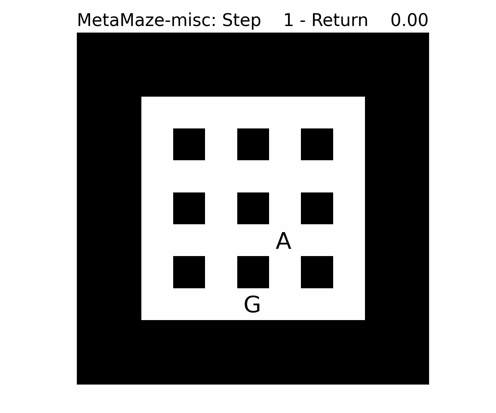 | 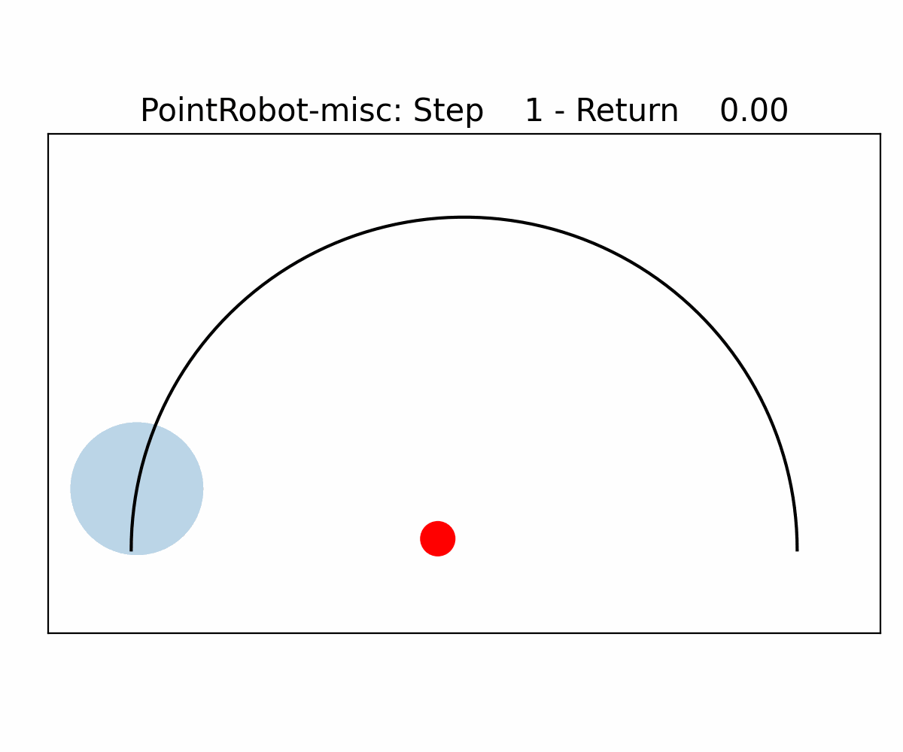 |

## Speed Up Evaluation for [`gymnax`](https://github.com/RobertTLange/gymnax) Environments

Finally, we provide simple tools for benchmarking the speed of step transitions on different hardware (CPU, GPU, TPU). For a specific environment the speed estimates can be obtained as follows:

```
python speed.py -env <env_name> --use_gpu --use_network --num_envs 10
```

Collect all speed estimates sequentially via:

```
bash exec.sh speed
```

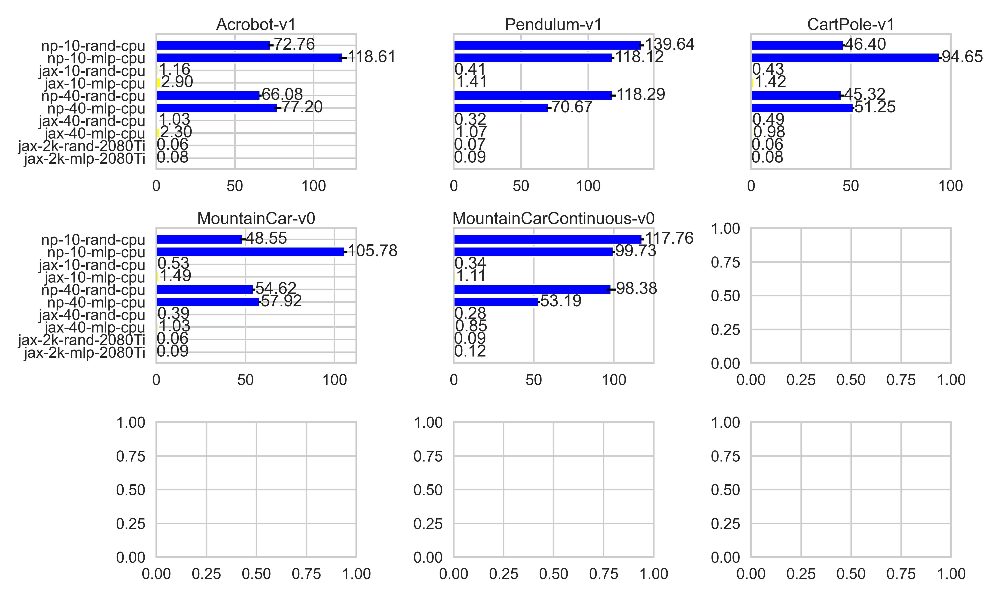

For each environment we estimate the seconds required to execute 1 Mio steps on various hardware and for both random (R)/neural network (N) policies. We report the mean over 10 independent runs:

| Environment Name | `np` <br /> CPU <br /> 10 Envs | `jax` <br /> CPU <br /> 10 Envs | `np` <br /> CPU <br /> 40 Envs | `jax` <br /> CPU <br /> 40 Envs | `jax` <br /> 2080Ti <br /> 2k Envs | `jax` <br /> A100 <br /> 2k Envs |
| --- | --- | --- | --- | --- | --- | --- | 
| [`Acrobot-v1`](https://github.com/RobertTLange/gymnax/blob/main/gymnax/environments/classic_control/acrobot.py) | R: 72 <br /> N: 118 | R: 1.16 <br /> N: 2.90 | R: 66 <br /> N: 77.2 | R: 1.03 <br /> N: 2.3 | R: 0.06 <br /> N: 0.08 | R: 0.07 <br /> N: 0.09
| [`Pendulum-v1`](https://github.com/RobertTLange/gymnax/blob/main/gymnax/environments/classic_control/pendulum.py) | R: 139 <br /> N: 118 | R: 0.41 <br /> N: 1.41 | R: 118 <br /> N: 70 | R: 0.32 <br /> N: 1.07 | R: 0.07 <br /> N: 0.09 | R: 0.07 <br /> N: 0.10
| [`CartPole-v1`](https://github.com/RobertTLange/gymnax/blob/main/gymnax/environments/classic_control/cartpole.py) | R: 46 <br /> N: 94 | R: 0.43 <br /> N: 1.42 | R: 45 <br /> N: 51 | R: 0.49 <br /> N: 0.98 | R: 0.06 <br /> N: 0.08 | R: 0.05 <br /> N: 0.08
| [`MountainCar-v0`](https://github.com/RobertTLange/gymnax/blob/main/gymnax/environments/classic_control/mountain_car.py) | R: 48 <br /> N: 105 | R: 0.53 <br /> N: 1.49 | R: 54 <br /> N: 57 | R: 0.39 <br /> N: 1.03 | R: 0.06 <br /> N: 0.09 | R: 0.07 <br /> N: 0.09
| [`MountainCarContinuous-v0`](https://github.com/RobertTLange/gymnax/blob/main/gymnax/environments/classic_control/continuous_mountain_car.py) | R: 117 <br /> N: 99 | R: 0.34 <br /> N: 1.11 | R: 98 <br /> N: 53 | R: 0.28 <br /> N: 0.85 | R: 0.09 <br /> N: 0.12 | R: 0.09 <br /> N: 0.12
|  |  |  |  |  |  |  |  |
| [`Asterix-MinAtar`](https://github.com/RobertTLange/gymnax/blob/main/gymnax/environments/minatar/asterix.py) | R: 62.95 <br /> N: 142.21 | R: 5.49 <br /> N: 20.15 | R: 55.08 <br /> N: 73.16 | R: 5.86 <br /> N: 22.46 | R: 0.89 <br /> N: 0.96 | R: 0.92 <br /> N: 0.98
| [`Breakout-MinAtar`](https://github.com/RobertTLange/gymnax/blob/main/gymnax/environments/minatar/breakout.py) | R: 49.35 <br /> N: 125.65 | R: 2.41 <br /> N: 13.70 | R: 48.30 <br /> N: 67.20 | R: 2.33 <br /> N: 13.93 | R: 0.20 <br /> N: 0.30 | R: 0.19 <br /> N: 0.26
| [`Freeway-MinAtar`](https://github.com/RobertTLange/gymnax/blob/main/gymnax/environments/minatar/freeway.py) | R: 49.91 <br /> N: 141.63 | R: 26.35 <br /> N: 74.02 | R: 50.04 <br /> N: 72.59 | R: 26.25 <br /> N: 53.66 | R: 1.17 <br /> N: 1.30 | R: 0.87 <br /> N: 0.95
| [`SpaceInvaders-MinAtar`](https://github.com/RobertTLange/gymnax/blob/main/gymnax/environments/minatar/space_invaders.py) | R: 65.58 <br /> N: 170.29 | R: 12.73 <br /> N: 33.51 | R: 69.24 <br /> N: 105.27 | R: 14.37 <br /> N: 30.09 | R: 0.35 <br /> N: 0.46 | R: 0.33 <br /> N: 0.39
|  |  |  |  |  |  |  |  |
| [`Catch-bsuite`](https://github.com/RobertTLange/gymnax/blob/main/gymnax/environments/bsuite/catch.py) | - | R: 0.99 <br /> N: 2.37 | - | R: 0.87 <br /> N: 1.82 | R: 0.17 <br /> N: 0.21 | R: 0.15 <br /> N: 0.21
| [`DeepSea-bsuite`](https://github.com/RobertTLange/gymnax/blob/main/gymnax/environments/bsuite/deep_sea.py) | - | R: 0.84 <br /> N: 1.97 | - | R: 1.04 <br /> N: 1.61 | R: 0.27 <br /> N: 0.33 | R: 0.22 <br /> N: 0.36
| [`MemoryChain-bsuite`](https://github.com/RobertTLange/gymnax/blob/main/gymnax/environments/bsuite/memory_chain.py) | - | R: 0.43 <br /> N: 1.46 | - | R: 0.37 <br /> N: 1.11 | R: 0.14 <br /> N: 0.21 | R: 0.13 <br /> N: 0.19
| [`UmbrellaChain-bsuite`](https://github.com/RobertTLange/gymnax/blob/main/gymnax/environments/bsuite/umbrella_chain.py) | - | R: 0.64 <br /> N: 1.82 | - | R: 0.48 <br /> N: 1.28 | R: 0.08 <br /> N: 0.11 | R: 0.08 <br /> N: 0.12
| [`DiscountingChain-bsuite`](https://github.com/RobertTLange/gymnax/blob/main/gymnax/environments/bsuite/discounting_chain.py) | - | R: 0.33 <br /> N: 1.32 | - | R: 0.21 <br /> N: 0.88 | R: 0.06 <br /> N: 0.07 | R: 0.06 <br /> N: 0.08
|  |  |  |  |  |  |  |  |
| [`FourRooms-misc`](https://github.com/RobertTLange/gymnax/blob/main/gymnax/environments/misc/rooms.py) | - | R: 3.12 <br /> N: 5.43 | - | R: 2.81 <br /> N: 4.6 | R: 0.09 <br /> N: 0.10 | R: 0.07 <br /> N: 0.10
| [`MetaMaze-misc`](https://github.com/RobertTLange/gymnax/blob/main/gymnax/environments/misc/meta_maze.py) | - | R: 0.80 <br /> N: 2.24 | - | R: 0.76 <br /> N: 1.69 | R: 0.09 <br /> N: 0.11 | R: 0.09 <br /> N: 0.12
| [`PointRobot-misc`](https://github.com/RobertTLange/gymnax/blob/main/gymnax/environments/misc/point_robot.py) | - | R: 0.84 <br /> N: 2.04 | - | R: 0.65 <br /> N: 1.31 | R: 0.08 <br /> N: 0.09 | R: 0.08 <br /> N: 0.10
| [`BernoulliBandit-misc`](https://github.com/RobertTLange/gymnax/blob/main/gymnax/environments/misc/bernoulli_bandit.py) | - | R: 0.54 <br /> N: 1.61 | - | R: 0.42 <br /> N: 0.97 | R: 0.07 <br /> N: 0.10 | R: 0.08 <br /> N: 0.11
| [`GaussianBandit-misc`](https://github.com/RobertTLange/gymnax/blob/main/gymnax/environments/misc/gaussian_bandit.py) | - | R: 0.56 <br /> N: 1.49 | - | R: 0.58 <br /> N: 0.89 | R: 0.05 <br /> N: 0.08 | R: 0.07 <br /> N: 0.09

TPU v3-8 comparisons will follow once I (or you?) find the time and resources 🤗